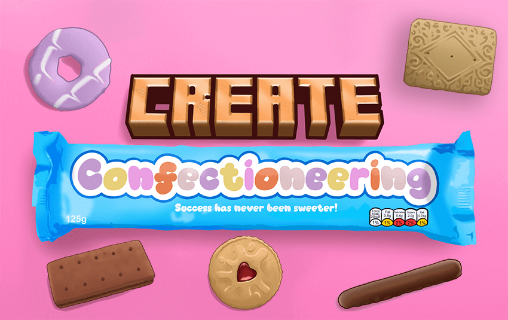

<h1 align="center">Create: Confectioneering   
	
	
	
      
</h1>

Confectioneering is an addon mod to the popular Create mod adding new types of confection with factory inspired processes to create them.
